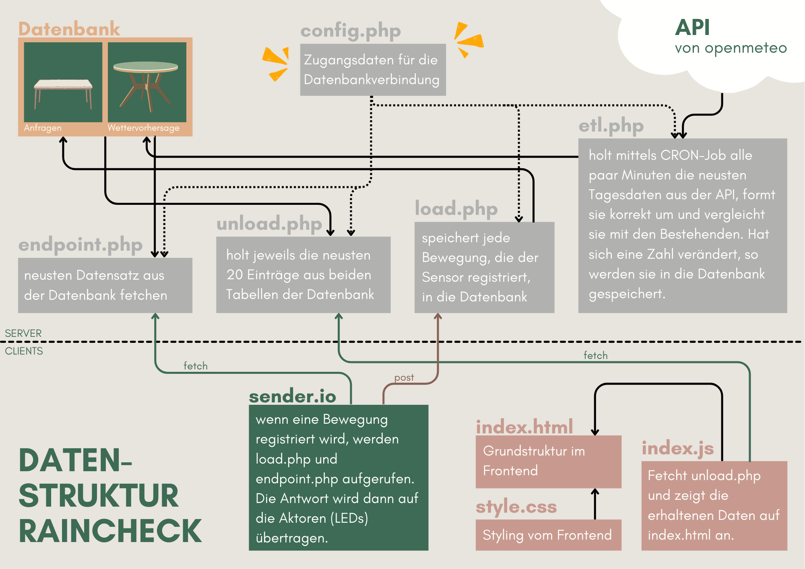
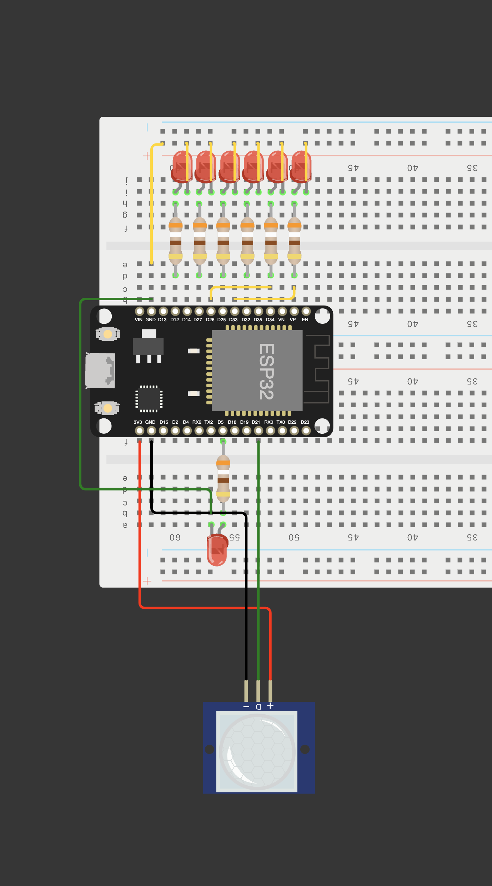
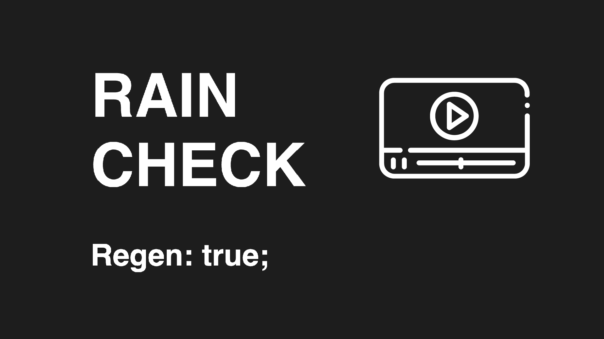
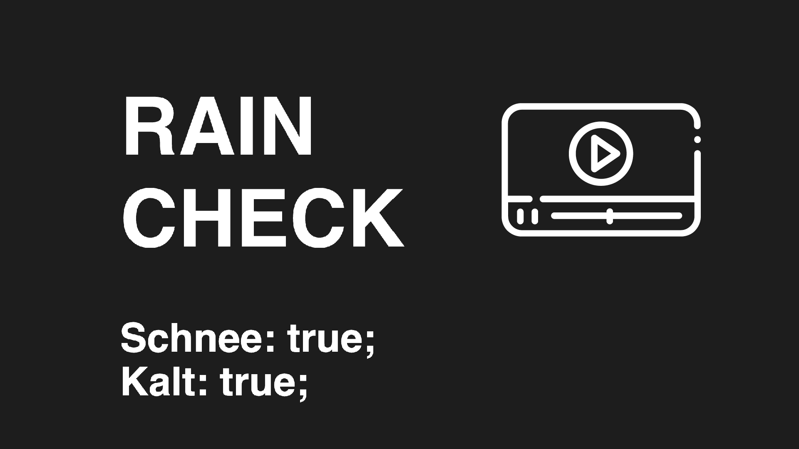
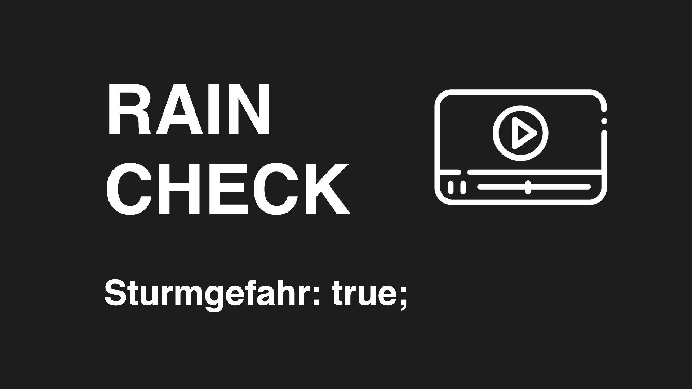
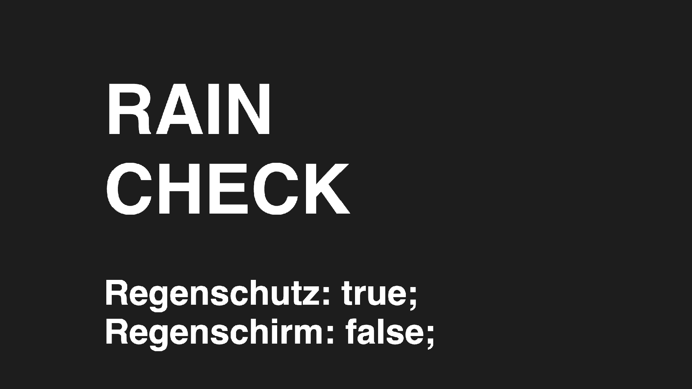

# RainCheck
RainCheck ist ein Wetterindikator, der idealerweise bei der Haustür platziert wird. Das Gerät kombiniert ein minimalistisches Design mit praktischer Funktionalität: Sobald der integrierte Bewegungssensor eine Person erkennt, aktiviert sich die LED-Anzeige und visualisiert die aktuellen Wetterdaten in Echtzeit. Die Daten werden für unseren Studienort Chur abgerufen.

Begleitend zum physischen Indikator bietet die Webseite www.raincheck.ch eine digitale Ergänzung. Hier finden Nutzer dieselbe Wettervisualisierung und können zusätzlich auf erweiterte Informationen zugreifen. Die Webseite dient zugleich als Schnittstelle zu unserer Datenbank, die in Kombination mit der API von open-meteo.com die Wetterdaten sammelt und aufbereitet.

RainCheck – für einen schnellen, klaren Wetterüberblick direkt vor der Tür oder online.

## Inhaltsverzeichnis

- [Idee](#idee)
- [Vorgehen](#vorgehen)
- [Challenges und Lernerfolge](#challenges-und-lernerfolge)
- [Technik](#technik)
- [UX](#ux)
- [Known Bugs](#known-bugs)
- [Fun Facts](#fun-facts)
- [Lizenz](#lizenz)
- [RainCheck in Action](#raincheck-in-action)

## Idee
Wie kommt man auf die Idee, Wetterdaten aus einer API abzulesen und diese bei bestimmten Bedingungen auf einem LED-Board anzuzeigen? Keine Ahnung. Vermutlich, weil wir beide schon viel zu oft das Haus ohne Schirm oder Regenjacke verlassen haben, nur um dann völlig verschüttet zu werden. Ärgerlich... Daraus ist raincheck.ch entstanden: je nach Tagesprognose in Chur leuchten andere LEDs auf dem Board. Sei es besonders kalt, regnerisch, windig oder gäbe es Schnee: ab sofort wissen wir beim Verlassen der Wohnung, was uns erwartet. Mit Hilfe der Daten aus der API von open-meteo haben wir eine laufende Prognose.

## Vorgehen
Die Idee hatten wir schon relativ früh. Nach den ersten Tagen in Physical Computing (Teil des Moduls «Interaktive Medien V» der FHGR), bei denen wir uns mit dem ESP32 und dem Steckbrett vertraut gemacht haben, bestellten wir zeitnah den Bewegungssensor für unser Projekt. Dann ging es ans Erarbeiten des Konzepts: wann sollte welches LED leuchten? Wie bauen wir die Datenstruktur auf? Was muss in die Datenbank geschrieben werden? Wie sieht unsere Webseite aus? Ergänzen wir mit Extras, wie z.B. nebst Digital zu Physisch auch von Physisch zu Digital?
Nachdem wir die Grundstruktur gebaut hatten und erste php-Abfragen zum Funktionieren brachten, waren wir schon gut unterwegs. In der zweiten Blockwoche erarbeiteten wir unsere genaue Datenarchitektur, die uns erheblich weiterbrachte. Beim ESP32 war es viel Trial & Error und wir merkten, dass wir noch viel zu wenig darüber wussten. Viele Stunden später haben wir es jedoch geschafft, und man kann wirklich sagen, dass wir etwas Tolles auf die Beine gestellt haben!

## Challenges und Lernerfolge
Challenges hatten wir definitiv genug. Da wir relativ früh ins Projekt gestartet sind und noch kaum Erfahrung mit Hardware wie dem ESP32 hatten, gerieten wir oftmals in Sackgassen und mussten nochmals einige Schritte zurück machen. Mittlerweile würden wir das ganze Projekt wohl in der Hälfte der Zeit abschliessen, aber genau da liegt ja der Lernerfolg. Eine weitere Challenge war die Arbeitsteilung. Aufgrund der physischen Komponente des Microcontrollers war es schwierig, dass wir beide zeitgleich daran arbeiten konnten. So teilten wir uns dann auf, was jedoch dazu führte, dass wir uns oft absprechen mussten bezüglich Kommunikationswegen der Programme und bezüglich der Logik. Dies verlangsamte den Prozess, und ausserdem brauchte es etwas mehr Zeit, um uns gegenseitig das eigene Werken beizubringen.
Bei der Software war eine Challenge, dass php & co. doch schon einige Monate nicht mehr genutzt wurde, weshalb ein erstaunlich grosser Teil der Zeit fürs Wiedererarbeiten der Syntax draufging. Auch Debugging war viel nötig, da teilweise falsche Variablennamen oder Funktionen eingebaut wurden.
Beim ESP32 und der Arduino Software gab es auch so einige Hürden. So war es eine Challenge, bis der Code zum Abrufen des aktuellen Datums und Uhrzeit am passenden Ort in den Schlaufen platziert war. A pro pos Schlaufen. Der Microcontroller arbeitet Schlaufen jeweils nacheinander ab. Somit mussten gewisse Prozesse, die einen Moment dauern sollten so umgeschrieben werden, dass alles aufgeht, auch wenn sich was blockiert etc. z.B. beim Blinken der individuellen LEDs. Doch es war machbar und der Code ist nun auch verständlich kommentiert. :)

## Technik
Dieses Projekt wurde mit folgenden Technologien umgesetzt:

physisch:
- ESP32 Dev Modul
- Bewegungssensor
- LED-Board

digital:
- PHP
- MySQL
- HTML
- CSS
- JavaScript
- Webserver????????

### Unsere Datenstruktur:

### Unser Steckbrett:

Unser Steckbrett kann bei Wokwi virtuell betrachtet und direkt bearbeitet werden.

**[RainCheck Steckbrett – Wokwi Simulation](https://wokwi.com/projects/415264541148403713)**

## UX
Zusätzlich zu unserem LED-Board haben wir uns dazu entschieden, eine Webseite zu erstellen, auf der die aktuellen Daten angezeigt werden. Dabei haben wir uns an der physischen Komponente orientiert: auch digital sollen die Daten mit LEDs angezeigt werden, die je nach Wetterbedingungen leuchten oder blinken. Ansonsten ist die Seite sehr minimalistisch gestaltet. Wir haben uns für ein schlichtes Design entschieden, um die Aufmerksamkeit auf die Wetterdaten zu lenken. Die Seite ist responsiv und funktioniert auch auf mobilen Geräten. Das UX war etwas der letzten Dinge, die wir erledigten, da wir uns zuerst auf die Funktionalität konzentrierten. Als Goodie visualisieren wir auf der Webseite registrierte Bewegungen des Wetterindikators.

## Known Bugs
Die Microcontroller - oder zumindest, die von uns verwendeten ESP32 - können teilweise nur mit neuem Code bespielt werden, wenn gewisse Sensoren, wie unser PIR Sensor nicht angeschlossen sind. Das hat uns mindestens 2 Tage Frustration beschert, bis wir das herausgefunden haben.

## Fun Facts
Die LED mit dem Label «Du bist schön!» leuchtet immer auf – ein kleines, aber wichtiges Detail, das uns am Herzen liegt. Wir möchten Menschen daran erinnern, dass sie wertvoll und einzigartig sind.

RainCheck ist für uns viel mehr als nur ein Projekt – es ist der krönende Abschluss unseres gemeinsamen Weges im MMP-Studium. Wir blicken auf zahlreiche gemeinsame Gruppenarbeiten zurück, in denen die Zusammenarbeit immer inspirierend und bereichernd war. Diese Erfahrungen haben uns als Team  zusammengeschweisst.

Mit RainCheck haben wir uns entschieden, im Rahmen des Studiums ein letztes gemeinsames Projekt zu realisieren – und was für eines! Neben all den rein digitalen Werken konnten wir nun auch etwas Greifbares schaffen: ein physisches Werk, das unsere Leidenschaft für kreative und technische Herausforderungen widerspiegelt.

## Aufgabenaufteilung
gemeinsam: Datenbank aufsetzen, Kommunikation mit API, Datenstruktur, etc.
Raphi: Hardware, Bewegungssensor, LED-Board, Kommunikation mit Datenbank
Simea: Datenbank, Kommunikation mit Datenbank, Frontend, UX/UI, Design und 3D Druck des Gehäuse

## Lizenz
Dieses Projekt ist unter der MIT-Lizenz lizenziert. Weitere Informationen finden Sie in der [LICENSE](LICENSE.txt) Datei.

## RainCheck in Action
### Achtung, Regen erwartet

### Heute kommt Schnee & Brrr, kalt!

### Achtung, Sturmgefahr

### Heute brauchst du einen Regenschutz. Lieber kein Schirm...

